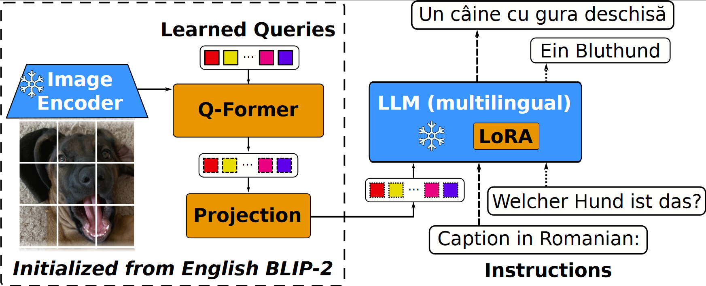

# mBLIP

This is the repository for our work [mBLIP: Efficient Bootstrapping of Multilingual Vision-LLMs](https://arxiv.org/abs/2307.06930).

## Model description
mBLIP is a [BLIP-2](https://arxiv.org/abs/2301.12597) model which consists of 3 sub-models: a Vision Transformer (ViT), a Query-Transformer (Q-Former) and a large language model (LLM).

The Q-Former and ViT have both been initialized by an English BLIP-2 checkpoint ([blip2-flan-t5-xl](https://huggingface.co/Gregor/mblip-mt0-xl)) and then re-aligned 
to the multilingual LLM using a multilingual task mixture.

 

This allows the model to be used for tasks like:

- image captioning
- visual question answering (VQA)

in 96 languages.

#### Checkpoints
| Model                      | URL                                                                      |
|----------------------------|--------------------------------------------------------------------------|
| mBLIP mT0-XL               | [Hugging Face](https://huggingface.co/Gregor/mblip-mt0-xl)               |
| mBLIP BLOOMZ-7B            | [Hugging Face](https://huggingface.co/Gregor/mblip-bloomz-7b)            |
| mBLIP mT0-XL (old version) | [Hugging Face](https://huggingface.co/Gregor/mblip-mt0-xl/tree/v1-arxiv) |
#### Languages
mBLIP was trained on the following 96 languages:

`
af, am, ar, az, be, bg, bn, ca, ceb, cs, cy, da, de, el, en, eo, es, et, eu, fa, fi, fil, fr, ga, gd, gl, gu, ha, hi, ht, hu, hy, id, ig, is, it, iw, ja, jv, ka, kk, km, kn, ko, ku, ky, lb, lo, lt, lv, mg, mi, mk, ml, mn, mr, ms, mt, my, ne, nl, no, ny, pa, pl, ps, pt, ro, ru, sd, si, sk, sl, sm, sn, so, sq, sr, st, su, sv, sw, ta, te, tg, th, tr, uk, ur, uz, vi, xh, yi, yo, zh, zu
`

## Demo

We provide a simple Gradio [demo](demo.py).
When using 8-bit quantization to load the model, the demo requires ~10GB VRAM (during generation of sequences up to 256 tokens) along with ~12GB memory.

Alternative, use `python demo.py --cpu` to load and run the model on CPU only.
This needs around ~20GB of memory.

## Training and Evaluation

### Data
We release the data used to train and evaluate the model on [Hugging Face](https://huggingface.co/datasets/Gregor/mblip-train).
See [here](data/README.md) for details on how to reproduce our data files and licensing information.


### Setup 
We recommend Python 3.9 (newer version will likely also work but are untested).

To run our training and evaluation code, please install the following:

```
pip install -r requirements.txt
pip install -e ./trident
```

We use **trident**, a modular framework by [Fabian Schmidt](https://github.com/fdschmidt93) that combines
pytorch-lightning with hydra configs and Hugging Face datasets (along with some QoL features).


Our code is found in [src](src) and the hydra configs in [configs](configs).

### Training & Testing

The entry point into our code is done by calling `python run.py experiment=EXPERIMENT-FILENAME_FROM_configs/experiments` as the examples below show.

On `blip_checkpoint`: We initialize our model with a BLIP-2 model checkpoint but only with the Q-Former and ViT. 
Loading the model with `.from_pretrained("Salesforce/blip2-flan-t5-xl")` would load the LLM, too, which we
do **not** want. Instead, we manually downloaded the shard containing the ViT and Q-Former [here](https://huggingface.co/Salesforce/blip2-flan-t5-xl/tree/main), remove any LLM weights from the state_dict, and
save this state_dict to disk (see [this example script](util/creating_blip_checkpoint.py)). `blip_checkpoint` points to this state_dict file.


On `data_prefix`: Our data setup expects all dataset json files and images to be in specific folders relative to this.
If your folder structure is different, adapt the following part in the experiment yaml files:
```
train_data: ${data_prefix}/mblip/data  # <- Root to all dataset jsons, e.g., ${train_data}/xgqa etc.
train_image_root: ${data_prefix}/mblip/data/pretrain/images # Contains both the MSCOCO images and web images from BLIP used in instruction training.
xm3600_image_root: ${data_prefix}/iglue/datasets/Crossmodal3600/images
flickr_image_root: ${data_prefix}/iglue/datasets/flickr30k/flickr_images # Note: This folder also contains all MSCOCO images in our case.
gqa_image_root: ${data_prefix}/iglue/datasets/gqa/images
marvl_img_root: ${data_prefix}/iglue/datasets/marvl/images # Note: This folder also contains the NLVR images in the root (or for train, the numbered folders).
```


#### Warm-up

<details>
<summary> Click to expand </summary>

```bash
NUM_GPUS=4
ACCUM=4
now=$(date +"%m_%d_%Y_%H_%M_%S")
output=mblip/results/$now
data_prefix=path/to/data/jsons

HYDRA_FULL_ERROR=1 python3 run.py experiment=mblip_instruct \
  data_prefix=$data_prefix \
  ++test_after_training=False \
  hydra.run.dir=$output \
  trainer.devices=$NUM_GPUS trainer.accumulate_grad_batches=$ACCUM \
  trainer.max_epochs=1 trainer.val_check_interval=0.1  trainer.max_steps=8000 \
  ++train_file=ccs_synthetic_filtered_large_2273005_mt.json \
  module.model.use_lora=False  \
  module.model.freeze_qformer=True \
  module.model.train_checkpoint=null \
  module.optimizer.lr=0.005 module.optimizer.weight_decay=0.1 \
  datamodule.dataloader_cfg.train.batch_size=8 datamodule.dataloader_cfg.train.num_workers=4 \
  datamodule.dataloader_cfg.val.batch_size=8 datamodule.dataloader_cfg.val.num_workers=0 \
  +trainer.strategy=ddp 
```
</details>


#### Instruction Training

<details>
<summary> Click to expand </summary>

mT0
```bash
NUM_GPUS=4
ACCUM=4
now=$(date +"%m_%d_%Y_%H_%M_%S")
output=mblip/results/$now
data_prefix=path/to/data/jsons

HYDRA_FULL_ERROR=1 python3 run.py experiment=mblip_instruct \
  data_prefix=$data_prefix \
  ++test_after_training=False \
  hydra.run.dir=$output \
  trainer.devices=$NUM_GPUS trainer.accumulate_grad_batches=$ACCUM \
  trainer.max_epochs=2 trainer.val_check_interval=0.2 \
  ++train_file=task_mix_v2_mt.json \
  module.model.use_lora=lora_all  \
  module.optimizer.lr=0.00005 module.optimizer.weight_decay=0.1 \
  ++module._target_="src.modules.trident_module.blip_grouped_optimizer.GroupedOptimizerTridentModule" \
  ++module.optimizer.blip_lr=0.00001 ++module.optimizer.llm_lora_lr=0.0002 \
  module.model.train_checkpoint=/path/to/checkpoint/after/warmup  \ # Optional
  datamodule.dataloader_cfg.train.batch_size=8 datamodule.dataloader_cfg.train.num_workers=4 \
  datamodule.dataloader_cfg.val.batch_size=8 datamodule.dataloader_cfg.val.num_workers=0 \
  +trainer.strategy=ddp 
```

BLOOMZ
```bash
NUM_GPUS=4
ACCUM=8
now=$(date +"%m_%d_%Y_%H_%M_%S")
output=/a/mm/data/a-g-geigle/mblip/results/$now


HYDRA_FULL_ERROR=1 python3 run.py experiment=mblip_instruct \
  data_prefix=/a/mm/data/a-g-geigle \
  ++imagenet_image_root=/a/mm/data/imagenet/train \
  ++test_after_training=False \
  hydra.run.dir=$output \
  trainer.devices=$NUM_GPUS trainer.accumulate_grad_batches=$ACCUM \
  trainer.max_epochs=2 trainer.val_check_interval=0.1 \
  ++train_file=task_mix_v2_mt.json \
  module.model.use_lora=lora_all \
  ++module.model.random_init_projection=True  \
  llm=bigscience/bloomz-7b1 \
  ++datamodule.dataloader_cfg.collate_fn.padding_side="left" \ 
  module.model.lora_r=8 module.model.lora_alpha=16 \
  module.model.lora_dropout=0.05 \
  module.model.load_8bit=4bit \
  module.optimizer.lr=0.00001 module.optimizer.weight_decay=0.1 \
  ++module._target_="src.modules.trident_module.blip_grouped_optimizer.GroupedOptimizerTridentModule" \
  ++module.optimizer.blip_lr=0.00001 ++module.optimizer.llm_lora_lr=0.0002 \
  ++module.model.train_checkpoint=null  \
  datamodule.dataloader_cfg.train.batch_size=4 datamodule.dataloader_cfg.train.num_workers=1 \
  datamodule.dataloader_cfg.val.batch_size=4 datamodule.dataloader_cfg.val.num_workers=1 \
  +trainer.strategy=ddp 
```

</details>

If you want to merge the LoRA weights after training into the LLM, use the scripts in [util](util).


#### Evaluate

<details>
<summary> Click to expand </summary>

```bash
NUM_GPUS=1
ACCUM=4
now=$(date +"%m_%d_%Y_%H_%M_%S")
output=mblip/results/test/$now
data_prefix=path/to/data/jsons

# Evaluation experiment as one of mblip_test_xgqa/marvl/xvnli/flickr/maxm/xm3600

HYDRA_FULL_ERROR=1 python3 run.py experiment=mblip_test_xgqa \
  data_prefix=$data_prefix \
  hydra.run.dir=$output \
  trainer.devices=$NUM_GPUS \
  # Either the original LLM or the path to model on disk if you merged LoRA into the LLM
  module.model.lm_pretrained=bigscience/mt0-xl \
  # Use to load the training checkpoint of the Q-Former. Otherwise remove line.
  module.model.train_checkpoint=path/to/for/example/mblip/results/06_18_2023_09_09_57/checkpoints/0-30331.ckpt \
  # Set 'False' if no lora
  module.model.use_lora=True \
  # Use to load LoRA checkpoint into LLM. Otherwise remove line.
  ++module.model.lora_checkpoint=/path/to/for/example/mblip/results/06_18_2023_09_09_57/checkpoints/0-30331 \
  # Change batch size if you have OOM problems or increase if you can
  datamodule.dataloader_cfg.test.batch_size=16 datamodule.dataloader_cfg.test.num_workers=0 
```
</details>

You can also use `module.model.huggingface_checkpoint=Gregor/mblip-mt0-xl` to directly load
the checkpoint from HuggingFace. Note that 1) 8bit results are slightly worse than in
the paper because the ViT and Q-Former is also loaded in 8bit and not just the LLM, and 2) training
does not work with this option because the Q-Former is loaded in 8bit.

#### Finetune

<details>
<summary> Click to expand </summary>

```bash
NUM_GPUS=4
ACCUM=1  # Change so that train.batchsize * NUM_GPUS * ACCUM = wanted total batchsize
now=$(date +"%m_%d_%Y_%H_%M_%S")
data_prefix=path/to/data/jsons
task=xgqa #or xvnli/marvl
output=mblip/results/$task/$now


HYDRA_FULL_ERROR=1 python3 run.py experiment=mblip_finetune_$task \
  data_prefix=$data_prefix \
  ++test_after_training=False \
  hydra.run.dir=$output \
  trainer.devices=$NUM_GPUS trainer.accumulate_grad_batches=$ACCUM \
  module.model.use_lora=lora_all \
  module.optimizer.lr=0.00005 module.optimizer.weight_decay=0.1 \
  trainer.val_check_interval=1.0 \
  # Either the original LLM or the path to model on disk if you merged LoRA into the LLM
  module.model.lm_pretrained=/after/instructtrain/checkpoints/06_04_2023_13_45_02-0-30331 \
  # Use to load the training checkpoint of the Q-Former after training. Otherwise remove line.
  module.model.train_checkpoint=/after/instructtrain/checkpoints/06_04_2023_13_45_02/checkpoints/0-30331.ckpt \
  datamodule.dataloader_cfg.train.batch_size=64 datamodule.dataloader_cfg.train.num_workers=2 \
  datamodule.dataloader_cfg.val.batch_size=8 datamodule.dataloader_cfg.val.num_workers=2 \
  +trainer.strategy=ddp \
  ++seed=42 
```
</details>

Why `test_after_training=False`? It was easier for us to run a separate test script than configure lightning 
to correctly load the best checkpoint and LoRa weights after training.


## How to use with Hugging Face
The mBLIP model uses the existing BLIP-2 architecture available in Hugging Face so you can use it right away in your code.
For more code examples, we refer to the BLIP-2 [documentation](https://huggingface.co/docs/transformers/main/en/model_doc/blip-2#transformers.Blip2ForConditionalGeneration.forward.example).

#### Running the model on CPU

<details>
<summary> Click to expand </summary>

```python
import requests
from PIL import Image
from transformers import BlipProcessor, Blip2ForConditionalGeneration

processor = BlipProcessor.from_pretrained("Gregor/mblip-mt0-xl")
model = Blip2ForConditionalGeneration.from_pretrained("Gregor/mblip-mt0-xl")

img_url = 'https://storage.googleapis.com/sfr-vision-language-research/BLIP/demo.jpg' 
raw_image = Image.open(requests.get(img_url, stream=True).raw).convert('RGB')

question = "Describe the image in German."
inputs = processor(raw_image, question, return_tensors="pt")

out = model.generate(**inputs)
print(processor.decode(out[0], skip_special_tokens=True))
```
</details>

#### Running the model on GPU

##### In full precision 

<details>
<summary> Click to expand </summary>

```python
# pip install accelerate
import requests
from PIL import Image
from transformers import Blip2Processor, Blip2ForConditionalGeneration

processor = Blip2Processor.from_pretrained("Gregor/mblip-mt0-xl")
model = Blip2ForConditionalGeneration.from_pretrained("Gregor/mblip-mt0-xl", device_map="auto")

img_url = 'https://storage.googleapis.com/sfr-vision-language-research/BLIP/demo.jpg' 
raw_image = Image.open(requests.get(img_url, stream=True).raw).convert('RGB')

question = "Describe the image in German."
inputs = processor(raw_image, question, return_tensors="pt").to("cuda")

out = model.generate(**inputs)
print(processor.decode(out[0], skip_special_tokens=True))
```
</details>

##### In half precision (`bfloat16`)

<details>
<summary> Click to expand </summary>

```python
# pip install accelerate
import torch
import requests
from PIL import Image
from transformers import Blip2Processor, Blip2ForConditionalGeneration

processor = Blip2Processor.from_pretrained("Gregor/mblip-mt0-xl")
model = Blip2ForConditionalGeneration.from_pretrained("Gregor/mblip-mt0-xl", torch_dtype=torch.bfloat16, device_map="auto")

img_url = 'https://storage.googleapis.com/sfr-vision-language-research/BLIP/demo.jpg' 
raw_image = Image.open(requests.get(img_url, stream=True).raw).convert('RGB')

question = "Describe the image in German."
inputs = processor(raw_image, question, return_tensors="pt").to("cuda", torch.bfloat16)

out = model.generate(**inputs)
print(processor.decode(out[0], skip_special_tokens=True))
```
</details>

##### In 8-bit precision (`int8`)
>**Important:** Paper results only use int8 for the LLM weights while this loads all weights in int8. 
> We see that this gives slightly worse results but currently int8 for some model parts is not supported by HuggingFace.
<details>
<summary> Click to expand </summary>

```python
# pip install accelerate bitsandbytes
import torch
import requests
from PIL import Image
from transformers import Blip2Processor, Blip2ForConditionalGeneration

processor = Blip2Processor.from_pretrained("Gregor/mblip-mt0-xl")
model = Blip2ForConditionalGeneration.from_pretrained("Gregor/mblip-mt0-xl", load_in_8bit=True, device_map="auto")

img_url = 'https://storage.googleapis.com/sfr-vision-language-research/BLIP/demo.jpg' 
raw_image = Image.open(requests.get(img_url, stream=True).raw).convert('RGB')

question = "Describe the image in German."
inputs = processor(raw_image, question, return_tensors="pt").to("cuda", torch.bfloat16)

out = model.generate(**inputs)
print(processor.decode(out[0], skip_special_tokens=True))
```
</details>

## License
Our model and code is MIT licensed.

## Contact
This repository was created by Gregor Geigle and [Abhay Jain](https://github.com/jain-abhay). If you have any questions, feel free to open an issue.

## Citation
If you use our model or code, please cite the following:
```
@article{geigle2023mblip,
  author       = {Gregor Geigle and
                  Abhay Jain and
                  Radu Timofte and
                  Goran Glava\v{s}},
  title        = {mBLIP: Efficient Bootstrapping of Multilingual Vision-LLMs},
  journal      = {arXiv},
  volume       = {abs/2307.06930},
  year         = {2023},
  url          = {https://arxiv.org/abs/2307.06930},
  eprinttype    = {arXiv},
  eprint       = {2307.06930},
}
```
